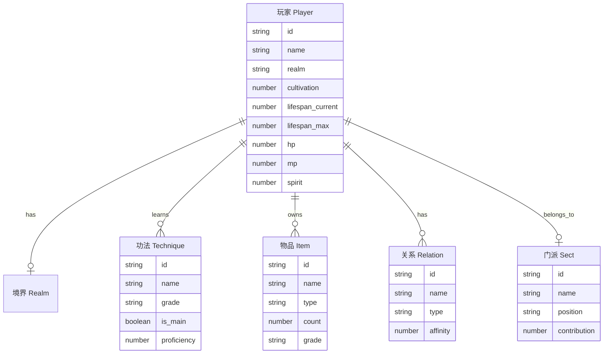

## 1. 架构设计

本项目为纯前端单页应用，无后端服务，所有数据使用内置 mock 数据。

```mermaid
flowchart TD
    "前端 React 应用" --> "页面组件层"
    "页面组件层" --> "六大系统面板"
    "六大系统面板" --> "通用组件库"
    "通用组件库" --> "状态管理 Zustand"
    "状态管理 Zustand" --> "Mock 数据层"
    "Mock 数据层" --> "本地 localStorage 持久化"
```

## 2. 技术说明

- **前端框架**：React@18 + TypeScript
- **构建工具**：Vite
- **样式方案**：Tailwind CSS@3 + 自定义 CSS 变量（水墨主题）
- **状态管理**：Zustand（轻量，适合单页多面板状态共享）
- **图标**：Lucide React + 自制 SVG 印章/符箓
- **字体**：Google Fonts 加载 `Ma Shan Zheng`、`Noto Serif SC`、`ZCOOL XiaoWei`
- **持久化**：localStorage 存储玩家状态，刷新不丢失
- **初始化工具**：vite-init（react-ts 模板）

## 3. 路由定义

本项目为单页应用，不使用 React Router，通过 Zustand 状态切换面板。

| 面板标识 | 用途 |
|---------|------|
| `profile` | 个人信息面板 |
| `technique` | 功法系统面板 |
| `treasure` | 财产与宝物面板 |
| `crafting` | 制作系统面板（内含画符/炼丹子页签） |
| `sect` | 门派经营面板 |
| `social` | 社交系统面板 |

## 4. API 定义

无后端，不涉及 API。所有数据交互通过 Zustand store 内部 action 完成。

## 5. 服务端架构

无服务端。

## 6. 数据模型

### 6.1 数据模型定义



### 6.2 数据定义语言

不使用数据库，所有数据以 TypeScript 接口定义于 `src/data/types.ts`，初始 mock 数据存于 `src/data/mockData.ts`，运行时通过 Zustand store 读写并同步至 localStorage。
